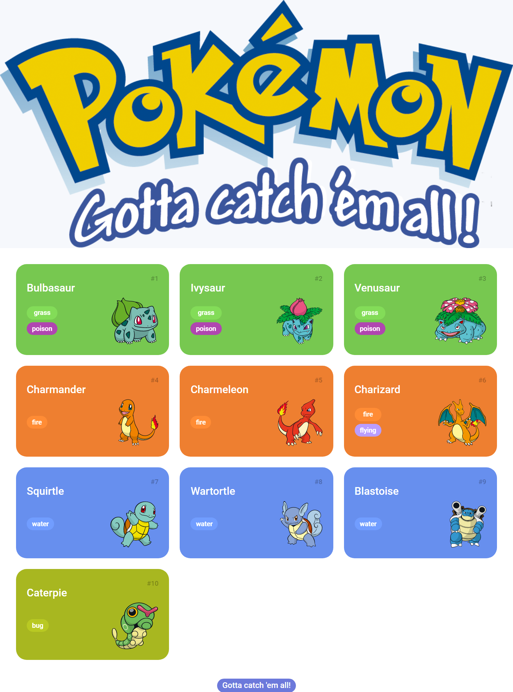
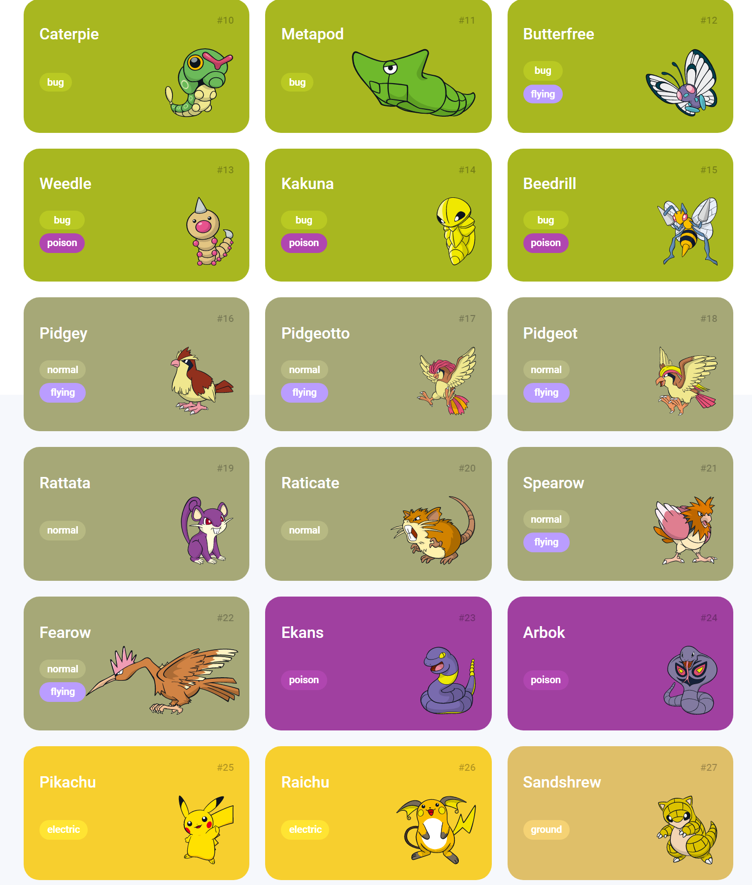

# Pokédex DIO

> Trilha Javascript Developer DIO

Projeto construído no Bootcamp Orange Tech na plataforma da DIO.

[ 🔗 Clique aqui para acessar](https://projeto-nlw-copa-rocketseat-se2n.vercel.app/)

## 🚀 Tecnologias

- HTML
- CSS
- Javascript
- Git e Github

## 💻 Projeto

Uma plataforma web 100% responsiva para listagem e visualização de pokémons. As características de cada pokémon como o tipo, imagem, nome, entre outros, foram possíveis de se mostrar graças ao uso da api rest PokéApi.

# ❤ Contato

Email: jonhy.willy.jw71@gmail.com  
Linkedin: https://www.linkedin.com/in/jonhy-willy-57b1051a4/

Feito com ♥ by Jonhy

